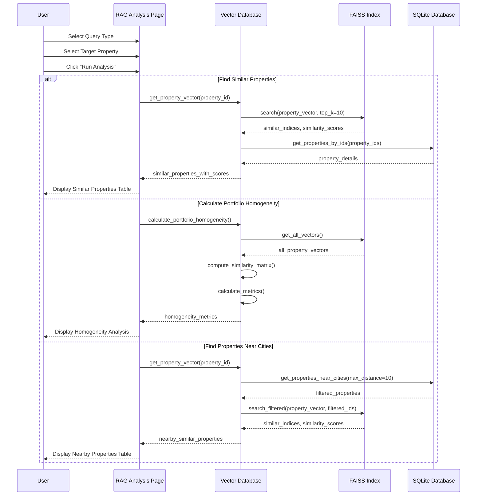
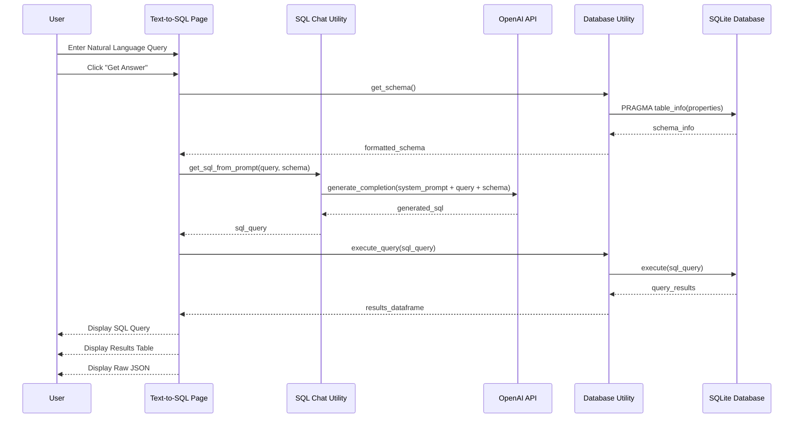
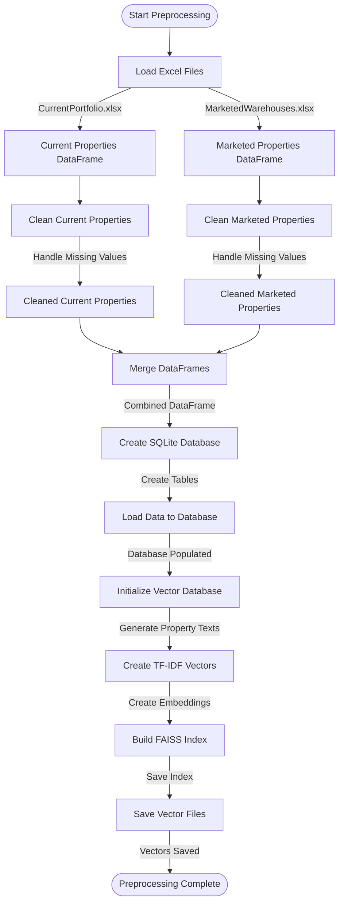
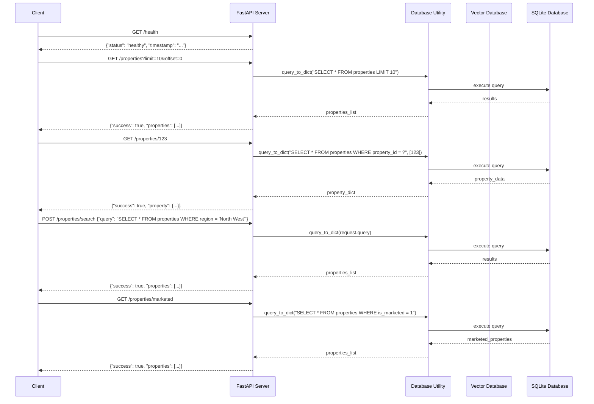
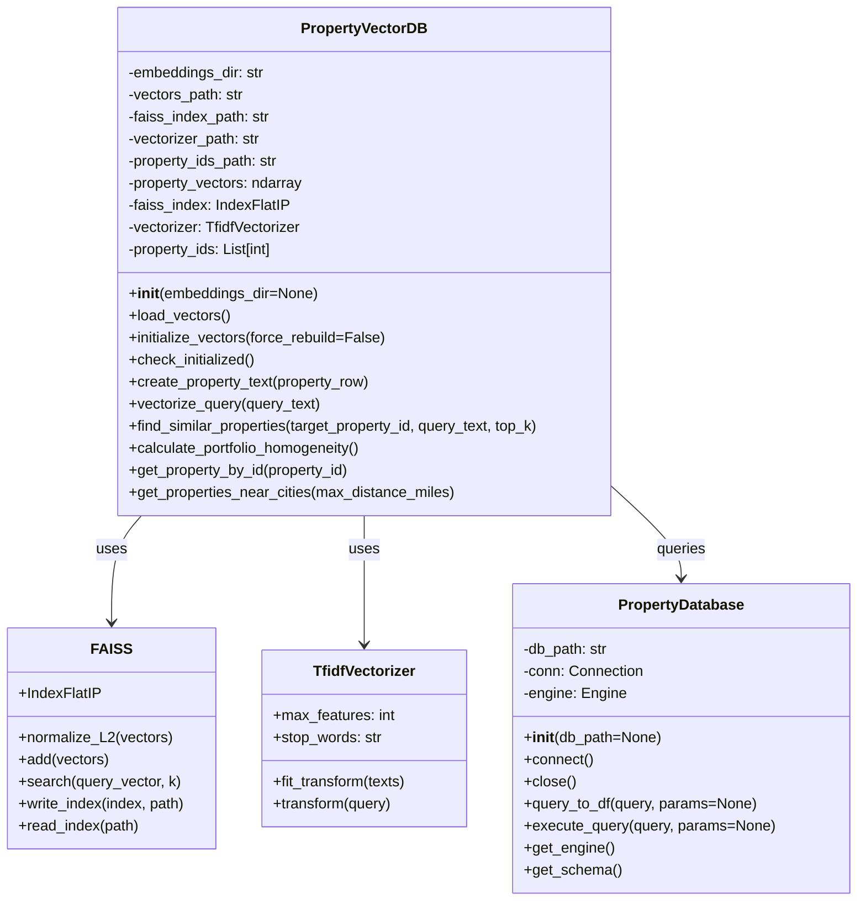

# MLI RAG Demo - System Architecture Diagrams

This directory contains architectural diagrams for the MLI RAG Demo application. The diagrams are created using Mermaid, a markdown-based diagramming tool.

## System Architecture

The overall system architecture of the MLI RAG Demo:

```mermaid
flowchart TB
    subgraph "Frontend"
        UI[Streamlit UI]
        UI --> |User Queries| Home[Home.py]
        Home --> Preprocess[1_Preprocess.py]
        Home --> TextToSQL[2_Text-to-SQL.py]
        Home --> RAGAnalysis[3_RAG_Analysis.py]
        Home --> SimpleQuery[4_Simple_Query.py]
    end
    
    subgraph "Backend API"
        API[FastAPI]
        API --> |Health Check| Health[/health]
        API --> |Property Data| PropAPI[/properties]
        API --> |SQL Queries| SQLAPI[/properties/search]
        API --> |RAG Analysis| RAGAPI[/rag]
    end
    
    subgraph "Core Utilities"
        Utils[Utils]
        Utils --> DBUtil[db_util.py]
        Utils --> VectorDBUtil[vector_db_util.py]
        Utils --> AIUtil[ai_util.py]
        Utils --> SQLChat[sql_chat.py]
        Utils --> PreprocessUtil[preprocess_util.py]
    end
    
    subgraph "Data Storage"
        Storage[Storage]
        Storage --> SQLite[(SQLite DB)]
        Storage --> FAISS[(FAISS Vector DB)]
        Storage --> Excel[(Excel Files)]
    end
    
    subgraph "External Services"
        External[External]
        External --> OpenAI[OpenAI API]
    end
    
    UI --> API
    TextToSQL --> SQLChat
    RAGAnalysis --> VectorDBUtil
    Preprocess --> PreprocessUtil
    PreprocessUtil --> DBUtil
    PreprocessUtil --> VectorDBUtil
    DBUtil --> SQLite
    VectorDBUtil --> FAISS
    SQLChat --> AIUtil
    AIUtil --> OpenAI
    PreprocessUtil --> Excel
```

## RAG Flow

The sequence diagram for the RAG Analysis process:



## Text-to-SQL Flow

The sequence diagram for the Text-to-SQL process:



## Preprocessing Flow

The flowchart for the data preprocessing pipeline:



## API Flow

The sequence diagram for the API endpoints:



## Vector Database Class Diagram

The class diagram for the vector database implementation:


